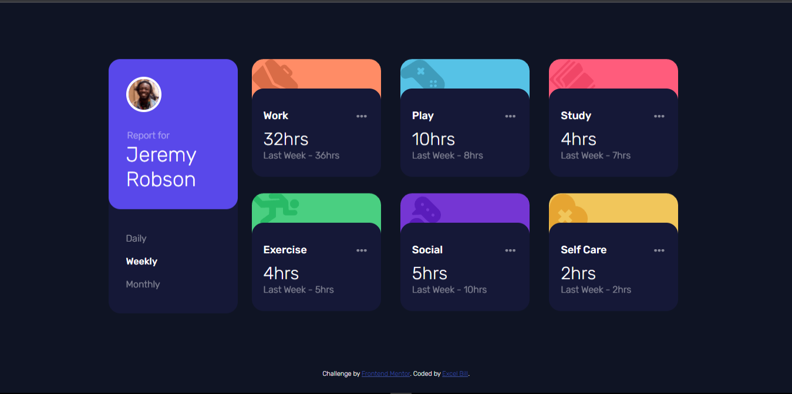

# Frontend Mentor - Time tracking dashboard solution

This is a solution to the [Time tracking dashboard challenge on Frontend Mentor](https://www.frontendmentor.io/challenges/time-tracking-dashboard-UIQ7167Jw). Frontend Mentor challenges help you improve your coding skills by building realistic projects. 

## Table of contents

- [Overview](#overview)
  - [The challenge](#the-challenge)
  - [Screenshot](#screenshot)
  - [Links](#links)
- [My process](#my-process)
  - [Built with](#built-with)
  - [What I learned](#what-i-learned)
  - [Continued development](#continued-development)
  - [Useful resources](#useful-resources)
- [Author](#author)
- [Acknowledgments](#acknowledgments)

**Note: Delete this note and update the table of contents based on what sections you keep.**

## Overview

### The challenge

Users will be able to:

- View the optimal layout for the site depending on their device's screen size
- See hover states for all interactive elements on the page
- Switch between viewing Daily, Weekly, and Monthly stats

### Screenshot




- Solution URL: (https://github.com/Kessyblaise1/time-tracking-dashboard-main)
- Live Site URL: https://expresstimetracker.netlify.app)

## My process
-First, I carefully thought out the building process after lookin at the design file.
-Next, I began by creating the html structure of the page.
-Then I moved forward to create reusable css classes and styles.
-Next, I proceeded to completing the UI with static html data.
-Finally, I added all the fucntionalities with JavaScript and pulled in the displayed data from the provided JSON file.

### Built with

- Semantic HTML5 markup
- CSS custom properties
- Flexbox
- CSS Grid
- Mobile-first workflow


### What I learned

I learned how to work with JSON data and use API fetch methods.

```
I'm particularly proud of the way I handled the data toggling from daily to weekly.
```


### Continued development

I will love to continue working with APIs to further sharppen my skills and improve my fluency with how API and SERVER data works.

### Useful resources

- I had a few challenges with handle data from JSON file and displaying different data based on the time interval the user was currently viewing, although I couldn't find a completely helpful article to ease my buggle, a few stackoverflow answers gave me a clue on what to do, I combined all of them to finally come up with what I did.

## Author

- Website - [Excel](https://excelbill.netlify.app)
- Frontend Mentor - [@kessyblaise1](https://www.frontendmentor.io/profile/kessyblaise1)
- Twitter - [@yourusername](https://www.twitter.com/excel_bill)
